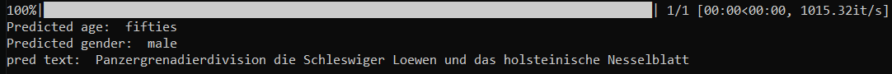

---
language:
- de
license: apache-2.0
tags:
- voice
- classification
- age
- gender
- speech
- audio
datasets:
- mozilla-foundation/common_voice_12_0
widget:
- src: >-
    https://huggingface.co/padmalcom/wav2vec2-asr-ultimate-german/resolve/main/test.wav
  example_title: Sample 1
pipeline_tag: audio-classification
metrics:
- accuracy
---

# German multi-task ASR with age and gender classification

This multi-task wav2vec2 based ASR model has two additional classification heads to detect:
- age
- gender
... of the current speaker in one forward pass.



It was trained on  [mozilla common voice](https://commonvoice.mozilla.org/).

Code for training can be found [here](https://github.com/padmalcom/wav2vec2-asr-ultimate-german).

*inference_online.py* shows, how the model can be used.

```python
from transformers import (
	Wav2Vec2FeatureExtractor,
	Wav2Vec2CTCTokenizer,
	Wav2Vec2Processor
)
import librosa
from datasets import Dataset
import numpy as np
from model import Wav2Vec2ForCTCnCLS
from ctctrainer import CTCTrainer
from datacollator import DataCollatorCTCWithPadding

model_path = "padmalcom/wav2vec2-asr-ultimate-german"
pred_data = {'file': ['audio2.wav']}

cls_age_label_map = {'teens':0, 'twenties': 1, 'thirties': 2, 'fourties': 3, 'fifties': 4, 'sixties': 5, 'seventies': 6, 'eighties': 7}
cls_age_label_class_weights = [0] * len(cls_age_label_map)

cls_gender_label_map = {'female': 0, 'male': 1}
cls_gender_label_class_weights = [0] * len(cls_gender_label_map)

tokenizer = Wav2Vec2CTCTokenizer("./vocab.json", unk_token="<unk>", pad_token="<pad>", word_delimiter_token="|")

feature_extractor = Wav2Vec2FeatureExtractor(feature_size=1, sampling_rate=16000, padding_value=0.0, do_normalize=True, return_attention_mask=False)

processor = Wav2Vec2Processor(feature_extractor, tokenizer)

model = Wav2Vec2ForCTCnCLS.from_pretrained(
	model_path,
	vocab_size=len(processor.tokenizer),
	age_cls_len=len(cls_age_label_map),
	gender_cls_len=len(cls_gender_label_map),
	age_cls_weights=cls_age_label_class_weights,
	gender_cls_weights=cls_gender_label_class_weights,
	alpha=0.1,
)

data_collator = DataCollatorCTCWithPadding(processor=processor, padding=True, audio_only=True)
	
def prepare_dataset_step1(example):
	example["speech"], example["sampling_rate"] = librosa.load(example["file"], sr=feature_extractor.sampling_rate)
	return example
	
def prepare_dataset_step2(batch):
	batch["input_values"] = processor(batch["speech"], sampling_rate=batch["sampling_rate"][0]).input_values
	return batch
	
val_dataset = Dataset.from_dict(pred_data)
val_dataset = val_dataset.map(prepare_dataset_step1, load_from_cache_file=False)
val_dataset = val_dataset.map(prepare_dataset_step2, batch_size=2, batched=True, num_proc=1, load_from_cache_file=False)
		
trainer = CTCTrainer(
	model=model,
	data_collator=data_collator,
	eval_dataset=val_dataset,
	tokenizer=processor.feature_extractor,
)

predictions, _, _ = trainer.predict(val_dataset, metric_key_prefix="predict")
logits_ctc, logits_age_cls, logits_gender_cls = predictions

# process age classification
pred_ids_age_cls = np.argmax(logits_age_cls, axis=-1)
pred_age = pred_ids_age_cls[0]
age_class = [k for k, v in cls_age_label_map.items() if v == pred_age]
print("Predicted age: ", age_class[0])

# process gender classification
pred_ids_gender_cls = np.argmax(logits_gender_cls, axis=-1)
pred_gender = pred_ids_gender_cls[0]
gender_class = [k for k, v in cls_gender_label_map.items() if v == pred_gender]
print("Predicted gender: ", gender_class[0])

# process token classification
pred_ids_ctc = np.argmax(logits_ctc, axis=-1)
pred_str = processor.batch_decode(pred_ids_ctc, output_word_offsets=True)
print("pred text: ", pred_str.text[0])
```